# The Professional COBOL Processing Model
**Author:** Student / Intern
**Context:** Easytrieve to COBOL Migration

This document outlines the standard "Batch Processing" flow used in professional mainframe development. It emphasizes data stability, error handling, and logical isolation.

---

## 1. The Mental Model (The 4 Phases)

Every COBOL program follows this strictly ordered lifecycle:

### Phase A: The Setup (Environment & Data)
* **Connect:** Link the physical file (PC/Mainframe disk) to a logical name (`SELECT`).
* **Buffer:** Define the "Mailbox" where raw data arrives (`FD` / `FILE SECTION`).
* **Workspace:** Define the "Desk" where you actually process the data (`WORKING-STORAGE`).

### Phase B: The Initialization (Procedure Start)
* **Open:** Open the files (`OPEN INPUT/OUTPUT`).
* **Check:** Immediately check `FILE STATUS` to ensure the file exists.
* **Prime:** Perform the **"Prime Read"** (Read the first record *before* the loop starts).

### Phase C: The Loop (The Engine)
* **Perform:** Start the loop `UNTIL` the "End of File" flag is TRUE.
* **Clean:** Clear your output workspace (`INITIALIZE` or `MOVE SPACES`) to prevent "garbage" data.
* **Process:** Move data from Input Workspace $\to$ Output Workspace. Apply logic (IF/ELSE/MATH).
* **Write:** Push the clean data from Workspace $\to$ File.
* **Next:** Read the *next* record at the bottom of the loop.

### Phase D: The Shutdown (Cleanup)
* **Close:** Close all files explicitly to save data to disk.
* **Stop:** End the run.

---

## 2. The Data Flow Diagram (READ INTO / WRITE FROM)

This method separates the "Physical" layer from the "Logical" layer, preventing crashes like `Status 71`.

```mermaid
graph TD
    subgraph "FILE SECTION"
        A[Input File on Disk] -->|READ| B(FD IN-BUFFER)
        F(FD OUT-BUFFER) -->|WRITE| G[Output File on Disk]
    end

    subgraph "WORKING-STORAGE"
        B -->|INTO| C{WS-IN-DATA}
        C -->|Logic / Moves| D{WS-OUT-DATA}
        D -->|FROM| F
    end

    style C fill:#000000,stroke:#333,stroke-width:2px,padding:4px
    style D fill:#000000,stroke:#333,stroke-width:2px

```



---

## 3. The "Golden Rules"

1. **Never Process in the Buffer:** Always use `READ ... INTO` and `WRITE ... FROM`. Don't touch the `FD` variables directly if you can avoid it.
2. **The "Prime Read" Pattern:** You must read *once* before the loop, and *again* at the very bottom of the loop.
* *Why?* If you put the READ at the top of the loop, you will process the last record twice or crash on an empty file.


3. **Close the Door:** Always finish your `IF/ELSE` logic with `END-IF` before triggering the next `READ`.
4. **Clean Your Desk:** Always `MOVE SPACES` or `INITIALIZE` your output structure at the start of every loop iteration.

---

## 4. The Master Skeleton Code

Use this template for every new task.

```cobol
       IDENTIFICATION DIVISION.
       PROGRAM-ID. TEMPLATE-PROG.

       ENVIRONMENT DIVISION.
       INPUT-OUTPUT SECTION.
       FILE-CONTROL.
           SELECT IN-FILE  ASSIGN TO "INPUT.DAT"
               ORGANIZATION IS LINE SEQUENTIAL
               FILE STATUS IS WS-STATUS.
           SELECT OUT-FILE ASSIGN TO "OUTPUT.DAT"
               ORGANIZATION IS LINE SEQUENTIAL.

       DATA DIVISION.
       FILE SECTION.
       FD  IN-FILE.
       01  IN-BUFFER           PIC X(100). *> Match actual record length

       FD  OUT-FILE.
       01  OUT-BUFFER          PIC X(100). *> Match actual record length

       WORKING-STORAGE SECTION.
       01  WS-FLAGS.
           05 WS-EOF           PIC X(01) VALUE 'N'.
              88 END-OF-FILE             VALUE 'Y'.
           05 WS-STATUS        PIC X(02).

       01  WS-IN-DATA.
           *> Define your Input Fields Here
           05 WS-IN-ID         PIC X(05).
           05 WS-IN-REST       PIC X(95).

       01  WS-OUT-DATA.
           *> Define your Output Fields Here
           05 WS-OUT-ID        PIC X(05).
           05 WS-OUT-REST      PIC X(95).

       PROCEDURE DIVISION.
       0000-MAIN.
           OPEN INPUT IN-FILE OUTPUT OUT-FILE
           
           IF WS-STATUS NOT = "00"
               DISPLAY "Error Opening File: " WS-STATUS
               STOP RUN
           END-IF

           *> 1. The Prime Read
           READ IN-FILE INTO WS-IN-DATA
               AT END SET END-OF-FILE TO TRUE
           END-READ

           *> 2. The Main Loop
           PERFORM 1000-PROCESS UNTIL END-OF-FILE

           CLOSE IN-FILE OUT-FILE
           STOP RUN.

       1000-PROCESS.
           *> A. Clean
           MOVE SPACES TO WS-OUT-DATA

           *> B. Logic
           MOVE WS-IN-DATA TO WS-OUT-DATA
           
           *> C. Write
           WRITE OUT-BUFFER FROM WS-OUT-DATA

           *> D. Read Next
           READ IN-FILE INTO WS-IN-DATA
               AT END SET END-OF-FILE TO TRUE
           END-READ.

```
